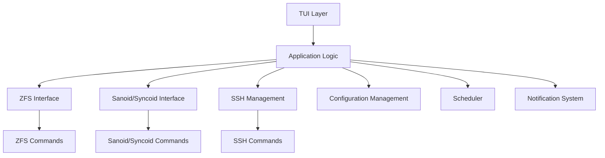
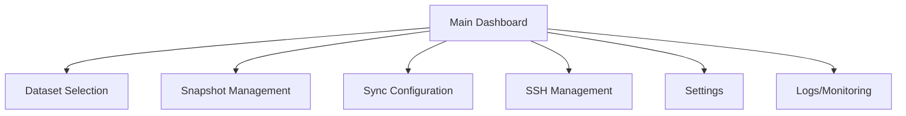
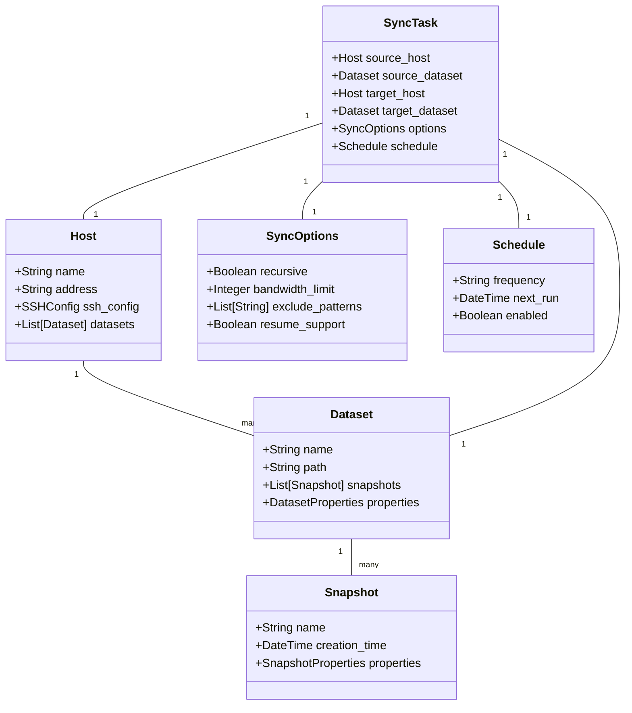

# ZFS Sync Tool - Project Plan

## 1. Project Overview

This project aims to build a Python-based Text User Interface (TUI) application that automates the synchronization of ZFS datasets between different hosts (local and remote), leveraging Sanoid/Syncoid for snapshot management and replication. The tool will support Linux distributions with ZFS (Ubuntu, Debian, etc.) and FreeBSD.

### Key Features:
- Dataset selection and management
- Snapshot management (creation, retention)
- Scheduled synchronization
- Bandwidth control for transfers
- SSH key management
- Detailed logging/monitoring of sync operations
- Email notifications for sync failures
- Ability to resume interrupted transfers

## 2. Architecture

The application will follow a modular architecture with clear separation of concerns:

### Components:

1. **TUI Layer**: User interface for interacting with the application
2. **Application Logic**: Core business logic
3. **ZFS Interface**: Interface with ZFS commands
4. **Sanoid/Syncoid Interface**: Interface with Sanoid/Syncoid
5. **SSH Management**: Manage SSH connections and keys
6. **Configuration Management**: Manage application configuration
7. **Scheduler**: Schedule synchronization tasks
8. **Notification System**: Send notifications (email, etc.)

## 3. Detailed Component Design

### 3.1 TUI Layer

The TUI will be built using a library like `textual` or `py_cui` and will include:

- Main dashboard showing system status
- Dataset selection screen
- Snapshot management screen
- Synchronization configuration screen
- SSH key management screen
- Settings screen
- Logs/monitoring screen

### 3.2 Application Logic

The core application logic will:
- Coordinate between different components
- Implement business rules
- Handle error conditions
- Manage state

### 3.3 ZFS Interface

This component will:
- List available datasets
- Get dataset properties
- Create/destroy datasets
- List snapshots
- Get snapshot properties

### 3.4 Sanoid/Syncoid Interface

This component will:
- Configure Sanoid for automatic snapshot creation
- Configure snapshot retention policies
- Trigger Syncoid for replication
- Monitor Syncoid operations
- Handle resuming interrupted transfers

### 3.5 SSH Management

This component will:
- Manage SSH keys
- Test SSH connections
- Handle SSH authentication

### 3.6 Configuration Management

This component will:
- Store and retrieve application configuration
- Validate configuration
- Import/export configuration

### 3.7 Scheduler

This component will:
- Schedule synchronization tasks
- Manage recurring tasks
- Handle task dependencies

### 3.8 Notification System

This component will:
- Send email notifications
- Log events
- Generate reports

## 4. Data Model

## 5. Implementation Plan

### Phase 1: Foundation (2-3 weeks)
- Set up project structure
- Implement ZFS interface
- Implement Sanoid/Syncoid interface
- Create basic configuration management
- Develop core application logic

### Phase 2: User Interface (2-3 weeks)
- Implement TUI framework
- Create main dashboard
- Implement dataset selection screen
- Implement snapshot management screen
- Implement synchronization configuration screen

### Phase 3: Advanced Features (2-3 weeks)
- Implement SSH key management
- Develop scheduler
- Create notification system
- Add logging and monitoring
- Implement bandwidth control

### Phase 4: Testing and Refinement (1-2 weeks)
- Comprehensive testing
- Bug fixes
- Performance optimization
- Documentation

## 6. Technology Stack

- **Language**: Python 3.8+
- **TUI Framework**: Textual or py_cui
- **Configuration**: TOML or YAML
- **Scheduling**: APScheduler
- **Logging**: Python's built-in logging module
- **Email**: smtplib
- **SSH**: Paramiko
- **Testing**: pytest

## 7. Detailed Sanoid/Syncoid Integration

### 7.1 Sanoid Integration

#### 7.1.1 Configuration Management
- **Generate Sanoid Configuration**: The tool will programmatically generate and update the Sanoid configuration file (`/etc/sanoid/sanoid.conf`) based on user preferences.
- **Template Management**: Create and manage templates for different snapshot retention policies.
- **Dataset Configuration**: Configure which datasets should be managed by Sanoid and which templates to apply.
- **Validation**: Validate Sanoid configuration before applying it to prevent errors.

#### 7.1.2 Snapshot Management
- **Snapshot Creation**: Use Sanoid's snapshot creation capabilities (`sanoid --take-snapshots`) to create snapshots according to defined schedules.
- **Snapshot Pruning**: Use Sanoid's pruning capabilities (`sanoid --prune-snapshots`) to manage snapshot retention.
- **Monitoring**: Monitor Sanoid's operations and capture output for logging and notification purposes.
- **Health Checks**: Use Sanoid's monitoring capabilities (`sanoid --monitor-snapshots`, `sanoid --monitor-health`) to check the health of snapshots and pools.

#### 7.1.3 Sanoid Script Hooks
- **Pre/Post Snapshot Scripts**: Configure and manage Sanoid's script hooks for pre-snapshot and post-snapshot operations.
- **Pruning Scripts**: Configure and manage Sanoid's pruning script hooks.
- **Custom Scripts**: Provide a library of useful scripts for common operations (e.g., quiescing databases before snapshots).

### 7.2 Syncoid Integration

#### 7.2.1 Replication Configuration
- **Source/Target Configuration**: Configure source and target datasets for replication.
- **Replication Options**: Configure Syncoid options such as compression, bandwidth limits, and recursive replication.
- **SSH Configuration**: Configure SSH options for remote replication.
- **Exclude Patterns**: Configure patterns for excluding datasets or snapshots from replication.

#### 7.2.2 Replication Execution
- **Command Generation**: Generate the appropriate Syncoid command based on user configuration.
- **Execution**: Execute Syncoid commands and capture output.
- **Progress Monitoring**: Monitor the progress of Syncoid operations using its output.
- **Error Handling**: Detect and handle errors in Syncoid operations.

#### 7.2.3 Advanced Syncoid Features
- **Resumable Transfers**: Leverage Syncoid's resumable transfer capabilities for handling interrupted transfers.
- **Bandwidth Control**: Use Syncoid's bandwidth limiting options (`--source-bwlimit`, `--target-bwlimit`).
- **Snapshot Management**: Configure Syncoid's snapshot management options (`--no-sync-snap`, `--keep-sync-snap`).
- **Bookmark Management**: Use Syncoid's bookmark capabilities (`--create-bookmark`) for efficient replication.

### 7.3 Integration Challenges and Solutions

#### 7.3.1 Version Compatibility
- **Version Detection**: Detect the installed versions of Sanoid and Syncoid.
- **Feature Detection**: Detect which features are available in the installed versions.
- **Compatibility Layer**: Provide a compatibility layer to handle differences between versions.

#### 7.3.2 Error Handling
- **Command Failures**: Handle failures in Sanoid and Syncoid commands.
- **Parsing Errors**: Handle errors in parsing Sanoid and Syncoid output.
- **Recovery Strategies**: Implement strategies for recovering from errors.

#### 7.3.3 Performance Optimization
- **Parallel Execution**: Execute multiple Syncoid operations in parallel when appropriate.
- **Resource Management**: Manage system resources (CPU, memory, network) during replication.
- **Scheduling**: Schedule operations to minimize impact on system performance.

#### 7.3.4 Security Considerations
- **SSH Key Management**: Securely manage SSH keys for remote replication.
- **Privilege Management**: Handle privilege requirements for ZFS operations.
- **Credential Storage**: Securely store and manage credentials.

## 8. Challenges and Considerations

1. **Error Handling**: ZFS operations can fail for various reasons (disk space, permissions, etc.). Robust error handling is essential.

2. **Security**: SSH key management and secure credential storage need careful implementation.

3. **Performance**: Large datasets or many snapshots might impact performance. Consider pagination and asynchronous operations.

4. **Compatibility**: Ensure compatibility with different versions of ZFS, Sanoid, and Syncoid.

5. **Testing**: Testing ZFS operations requires actual ZFS datasets. Consider using test pools or mock objects.

## 9. Future Enhancements

1. **Web Interface**: Add a web interface for remote management
2. **Complex Topologies**: Support for complex replication topologies (A→B→C or A→B, A→C)
3. **Conflict Resolution**: Advanced conflict resolution for bidirectional synchronization
4. **Analytics**: Storage usage analytics and visualization
5. **API**: REST API for integration with other systems